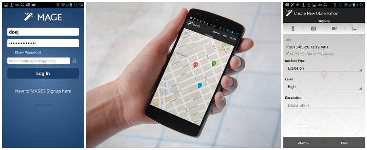

# MAGE Android

10/02/2015

This is the MAGE client for Android devices.

Depends on the [MAGE Android SDK](https://github.com/ngageoint/mage-android-sdk).

## About

The Mobile Awareness GEOINT Environment, or MAGE, provides mobile situational awareness capabilities. The MAGE app on your mobile device allows you to create geotagged field reports that contain media such as photos, videos, and voice recordings and share them instantly with who you want. Using the GPS in your mobile device, MAGE can also track users locations in real time. Your locations can be automatically shared with the other members of your team.

The app remains functional if your mobile device loses its network connection, and will upload its local content when a connection is re-established. When disconnected from the network, MAGE will use local data layers to continue to provide relevant GEOINT. Data layers, including map tiles and vector data, can stored on your mobile device and are available at all times.

MAGE is very customizable and can be tailored for you situation.

MAGE Android was developed at the National Geospatial-Intelligence Agency (NGA) in collaboration with BIT Systems. The government has "unlimited rights" and is releasing this software to increase the impact of government investments by providing developers with the opportunity to take things in new directions. The software use, modification, and distribution rights are stipulated within the Apache license.

## How to Build

Make sure to download the and build the sdk first.

### Build

./gradlew clean

./gradlew assembleLocalDebug

### Install

./gradlew installLocalDebug

### Test

./gradlew connectedAndroidTestLocalDebug

## Pull Requests

If you'd like to contribute to this project, please make a pull request. We'll review the pull request and discuss the changes. All pull request contributions to this project will be released under the Apache license.

Software source code previously released under an open source license and then modified by NGA staff is considered a "joint work" (see 17 USC § 101); it is partially copyrighted, partially public domain, and as a whole is protected by the copyrights of the non-government authors and must be released according to the terms of the original open source license.

## License

Copyright 2015 BIT Systems

Licensed under the Apache License, Version 2.0 (the "License");
you may not use this file except in compliance with the License.
You may obtain a copy of the License at

    http://www.apache.org/licenses/LICENSE-2.0

Unless required by applicable law or agreed to in writing, software
distributed under the License is distributed on an "AS IS" BASIS,
WITHOUT WARRANTIES OR CONDITIONS OF ANY KIND, either express or implied.
See the License for the specific language governing permissions and
limitations under the License.
